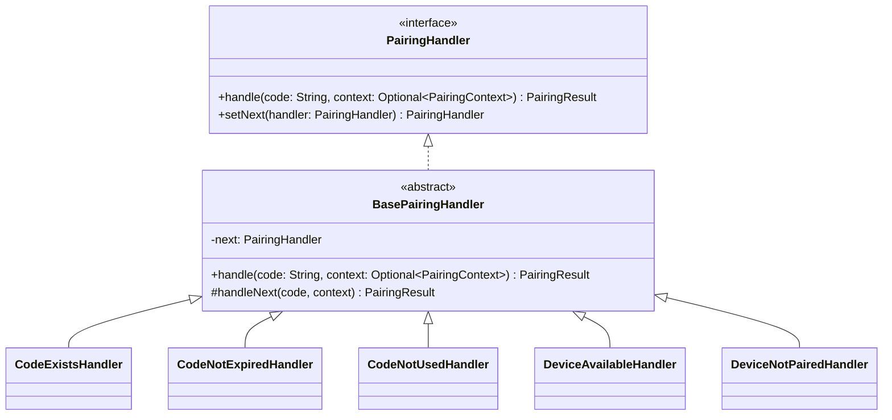
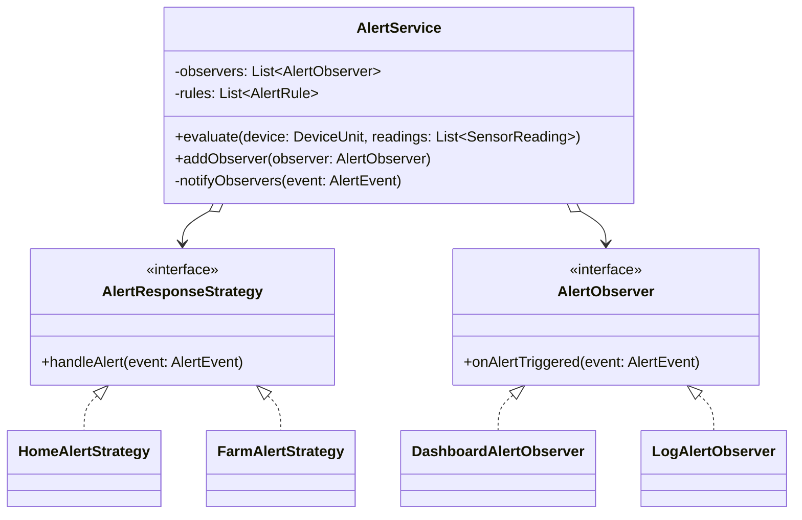

# Core Architecture Class Diagrams

## Pairing Chain of Responsibility

```mermaid
classDiagram
    class PairingHandler {
        <<interface>>
        +handle(code: String, context: Optional~PairingContext~) PairingResult
        +setNext(handler: PairingHandler) PairingHandler
    }
    
    class BasePairingHandler {
        <<abstract>>
        -next: PairingHandler
        +handle(code: String, context: Optional~PairingContext~) PairingResult
        #handleNext(code, context) PairingResult
    }
    
    class CodeExistsHandler
    class CodeNotExpiredHandler
    class CodeNotUsedHandler
    class DeviceAvailableHandler
    class DeviceNotPairedHandler
    
    PairingHandler <|.. BasePairingHandler
    BasePairingHandler <|-- CodeExistsHandler
    BasePairingHandler <|-- CodeNotExpiredHandler
    BasePairingHandler <|-- CodeNotUsedHandler
    BasePairingHandler <|-- DeviceAvailableHandler
    BasePairingHandler <|-- DeviceNotPairedHandler
```

## Alert Strategy & Observer

```mermaid
classDiagram
    class AlertService {
        -observers: List~AlertObserver~
        -rules: List~AlertRule~
        +evaluate(device: DeviceUnit, readings: List~SensorReading~)
        +addObserver(observer: AlertObserver)
        -notifyObservers(event: AlertEvent)
    }
    
    class AlertResponseStrategy {
        <<interface>>
        +handleAlert(event: AlertEvent)
    }
    
    class HomeAlertStrategy
    class FarmAlertStrategy
    
    class AlertObserver {
        <<interface>>
        +onAlertTriggered(event: AlertEvent)
    }
    
    class DashboardAlertObserver
    class LogAlertObserver
    
    AlertService o--> AlertResponseStrategy
    AlertService o--> AlertObserver
    
    AlertResponseStrategy <|.. HomeAlertStrategy
    AlertResponseStrategy <|.. FarmAlertStrategy
    
    AlertObserver <|.. DashboardAlertObserver
    AlertObserver <|.. LogAlertObserver
```
