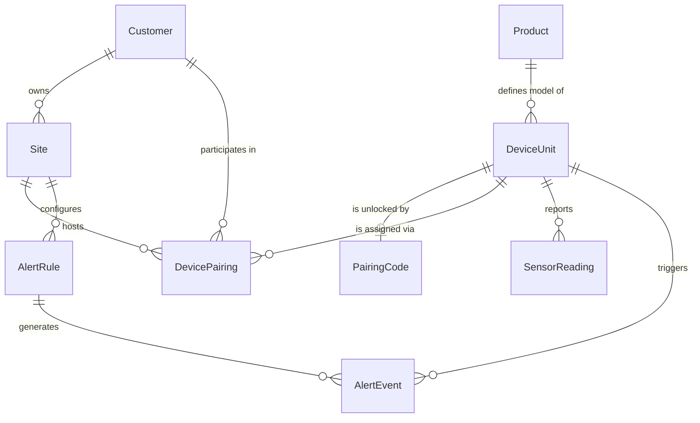

# Database Entity-Relationship Diagram

```mermaid
erDiagram
    Customer ||--o{ Site : "owns"
    Customer ||--o{ DevicePairing : "participates in"
    
    Product ||--o{ DeviceUnit : "defines model of"
    
    Site ||--o{ DevicePairing : "hosts"
    Site ||--o{ AlertRule : "configures"
    
    DeviceUnit ||--o| PairingCode : "is unlocked by"
    DeviceUnit ||--o{ DevicePairing : "is assigned via"
    DeviceUnit ||--o{ SensorReading : "reports"
    DeviceUnit ||--o{ AlertEvent : "triggers"
    
    AlertRule ||--o{ AlertEvent : "generates"
```
